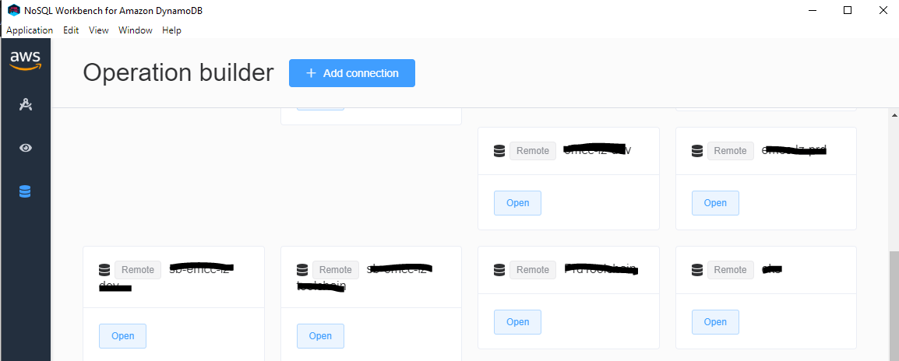

# Domain Driven Design 과 함께 하는 AWS Serverless 
AWS Lambda 와 AWS Dynamodb 를 기반으로 Serverless 애플리케이션 개발을 시작하기 위해서는 아래 툴을 반드시 설치해주세요.

## 사전 필수 설치
1. Desktop Docker  
https://docs.docker.com/docker-for-windows/install/  
AWS Dynamodb 를 로컬 환경에서 설치하기 위한 환경이 필요합니다.

2. GIT client 설치  
https://git-scm.com/download/win
소스코드를 다운로드 받기위한 클라이언트 입니다.  

3. Node JS 설치  
https://nodejs.org/ko/download/  
애플리케이션동이 동작하기 위한 런타임(Runtime) 환경입니다.

4. AWS Workbench 설치
https://docs.aws.amazon.com/ko_kr/amazondynamodb/latest/developerguide/workbench.settingup.html  
로컬에 설치된 Dynamodb 를 사용하기 위한 툴입니다.


## AWS Dynamodb 로컬 환경 구성하기
1. 도커가 설치되어 있는지 확인합니다.
```
C:\Users\leehee\>docker -v
Docker version 19.03.12, build 48a66213fe
C:\Users\leehee\>
```
1. 도커 네트워크를 생성합니다.
```
docker network create local-api-network
```

2. dynamodb 컨테이너를 실행합니다. 8000 포트를 사용하며, 앞서 생성한 네트워크에 바인딩하며, dynamo-local 이라는 이름으로 실행됩니다.
```
docker run -d -p8000:8000 --network=local-api-network --name dynamo-local amazon/dynamodb-local
```
   
윈도우즈 환경에서 도커를 삭제하고 싶다면,  
```
FOR /f "tokens=*" %i IN ('docker ps -a -q') DO docker rm --force %i
```

3. NoSQLWorkBench 를 실행하여, AWS Dynamodb 접속하기 위한 Profile 을 확인 합니다.




4. 로컬 환경의 AWS Dynamodb 를 CLI 를 통해서 액세스 하기 위한 Profile 정보를 셋팅 합니다.
```aws configure --profile dynamodb-local 을 실행하여 로컬 환경에서 실행합니다.```